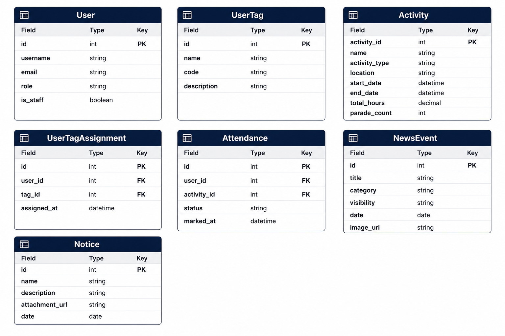

# 🎖️ National Cadet Corps (NCC) Web Portal

[](https://www.djangoproject.com/)
[](https://www.python.org/)
[](https://www.postgresql.org/)
[](https://cloudinary.com/)
[](LICENSE)

A centralized administrative, tracking, and operational portal designed to modernize college-level National Cadet Corps (NCC) units. This platform manages cadet profiles, coordinates training schedules, automates attendance calculations, hosts media galleries, and facilitates communication between cadets, faculty, and administrators.

---

## 📖 Table of Contents
1. [Core Features](#core-features)
2. [Visual Demos and Screenshots](#visual-demos-and-screenshots)
3. [Architecture and System Design](#architecture-and-system-design)
4. [Database Schema](#database-schema)
5. [Permissions and Role-Based Access Control](#permissions-and-role-based-access-control)
6. [Local Development Setup](#local-development-setup)
7. [Security and Production Readiness](#security-and-production-readiness)
8. [Developers](#developers)
9. [License](#license)

---

## Core Features

*   **Custom Cadet Profiles & Dashboards:** Dynamic, role-specific home pages presenting real-time stats including attendance percentages, total credit hours, and historical activity charts.
*   **Dynamic Attendance Tracker:** Schedules custom unit activities (parades, camps, drills, exam days) and computes total period durations dynamically. Supports batch attendance updates.
*   **Granular Permission Tags:** Implements dynamic User Tags (`UserTag`) to delegate site administration tasks (e.g., website manager, downloads coordinator, gallery publisher).
*   **Media Gallery CMS:** Responsive gallery modules supporting public and private files categorized by unit wings (Army Boys, Army Girls, Naval). Offloads asset storage to Cloudinary CDN.
*   **Official Digital Circulars:** Secure document distribution system for publishing circulars, attachments, and notices directly to student dashboards.
*   **Public Contact Integration:** Features a serverless EmailJS-backed contact form on public pages to handle incoming inquiries directly from the client side.

---

## Visual Demos and Screenshots

Explore the platform's key modules and user interfaces through these visual walk-throughs:

### Homepage & Public Portal
*A modern public-facing portal showcasing unit achievements, news, and cadet activities.*


---

### Cadet Profile & Analytics Dashboard
*Personalized dashboard highlighting attendance statistics, credit hours, and historical activity graphs.*


---

### Dynamic Attendance Tracker
*Schedules unit activities (parades, camps, drills) and dynamically aggregates attendance metrics in a batch-marking interface.*


---

### Attendance Reports & View
*Filtering, analyzing, and exporting attendance reports for individual cadets and unit wings.*


---

### Cloud Media Gallery Manager
*Media gallery CMS that uploads wing-specific images directly to Cloudinary CDN with real-time sync.*


---

## Architecture and System Design

The project uses the standard Django **Model-View-Template (MVT)** architecture. Business logic is organized into highly modular, decoupled apps:

*   `accounts`: Extends default Django user auth with `AbstractUser`, manages custom registration, role settings, and granular user tags.
*   `attendance`: Models training activities and manages attendance records using database aggregations.
*   `dashboard`: Orchestrates administrative control panels, profile metrics calculations, and tag assignments.
*   `events`: Handles public/internal announcements, news feeds, and cadet achievement timelines.
*   `gallery`: Connects image attachments directly to Cloudinary storage buckets.
*   `homepage`: Drives landing page sliders, statistics sections, and public text management.
*   `notice`: Stores official bulletins and file attachments.

---

## Database Schema

This project utilizes a highly normalized database schema optimized for complex joins, indexed lookups, and aggregate metrics tracking.

### Entity Relationship Diagram


### Model Structure

``` 
User {
    int id PK
    string username
    string email
    string role "ADMIN | FACULTY | CADET"
    boolean is_staff
}

UserTag {
    int id PK
    string name
    string code Slug_UNIQUE
    string description
}

UserTagAssignment {
    int id PK
    int user_id FK
    int tag_id FK
    datetime assigned_at
}

Activity {
    int activity_id PK
    string name
    string activity_type "PARADE | DRILL | CAMP | SOCIAL | DUTY | EXAM"
    string location
    datetime start_date
    datetime end_date
    decimal total_hours "AUTO_CALCULATED"
    int parade_count
}

Attendance {
    int id PK
    int user_id FK
    int activity_id FK
    string status "PRESENT | ABSENT"
    datetime marked_at
}

NewsEvent {
    int id PK
    string title
    string category "NEWS | EVENTS | ACHIEVEMENT"
    string visibility "PUBLIC | PRIVATE | INTERNAL"
    date date
    string image_url
}

Notice {
    int id PK
    string name
    string description
    string attachment_url
    date date
}
```

---

## Permissions and Role-Based Access Control

The portal separates users into primary profiles (`ADMIN`, `FACULTY`, `CADET`) and utilizes dynamic user permissions tags to delegate administrative tasks:

| Tag Code | Tag Name | Functionality |
| :--- | :--- | :--- |
| `website_manager` | Website Manager | Update the homepage layout, slider assets, and general configurations. |
| `gallery_manager` | Gallery Manager | Upload and filter gallery imagery (separated by Army Boys/Girls and Naval wings). |
| `news_editor` | News Editor | Write, edit, and publish unit announcements, internal news, and achievements. |
| `downloads_manager` | Downloads Manager | Upload official forms, files, syllabus papers, and downloadable cadet resources. |
| `attendance_marker` | Attendance Marker | Create training timetables and record batch attendance grids. |
| `attendance_viewer` | Attendance Viewer | Generate, filter, and download spreadsheet attendance reports (`.csv`). |
| `achievements_manager`| Achievements Manager| Manage public cadet recognition and achievements lists. |

---

## Local Development Setup

Follow these steps to configure and run the application locally:

### 1. Clone & Set Up Environment
```bash
# Clone the repository
git clone https://github.com/Adil-km/NCC_Web_Portal.git
cd NCC_Web_Portal

# Initialize virtual environment
python -m venv .venv

# Activate virtual environment
# Windows (cmd/PowerShell):
.venv\Scripts\activate
# Unix/macOS:
source .venv/bin/activate

# Install dependencies
pip install -r requirements.txt
```

### 2. Configure Environment Variables
Create a `.env` file in the project's root directory and define the configuration values:
```ini
DEV=True # Set to False in production to utilize PostgreSQL instead of SQLite

# Database configuration (Only read when DEV=False)
NAME=postgres
USER=postgres
PASSWORD=your_password
HOST=localhost
DB_PORT=5432

# Cloudinary CDN Configuration
CLOUDINARY_CLOUD_NAME=your_cloud_name
CLOUDINARY_API_KEY=your_api_key
CLOUDINARY_API_SECRET=your_api_secret
```

### 3. Initialize Database & Run Migrations
```bash
python manage.py migrate
```

### 4. Seed User Tags & Permissions
Run the seed script via the Django interactive shell to configure the RBAC structure:
```bash
python manage.py shell
```
Execute the following python block:
```python
from accounts.models import UserTag

tags = [
    {"name": "Website Manager", "code": "website_manager", "description": "Manage sliders and content on the public home page."},
    {"name": "Attendance Marker", "code": "attendance_marker", "description": "Mark attendance records for assigned cadets."},
    {"name": "Downloads Manager", "code": "downloads_manager", "description": "Upload and manage cadet resource downloads."},
    {"name": "Gallery Manager", "code": "gallery_manager", "description": "Add, edit, or delete items in the image gallery."},
    {"name": "News Editor", "code": "news_editor", "description": "Publish internal/external news updates and events."},
    {"name": "Achievements Manager", "code": "achievements_manager", "description": "Manage student achievements lists."},
    {"name": "Attendance Viewer", "code": "attendance_viewer", "description": "Analyze and extract attendance reports."}
]

for tag in tags:
    obj, created = UserTag.objects.get_or_create(code=tag["code"], defaults={"name": tag["name"], "description": tag["description"]})
    print(f"{'Created' if created else 'Verified'}: {obj.name}")
```

### 5. Create a Superuser & Run Server
```bash
# Create primary administrative user
python manage.py createsuperuser

# Start development server
python manage.py runserver
```
Open `http://127.0.0.1:8000/` in your browser.

---

## Security and Production Readiness

The application has been hardened and structured for hosting on web-platform hosts like Heroku or Render:
*   **Secure Content Delivery:** Media assets are securely stored on Cloudinary via HTTPS endpoints.
*   **Static Asset Offloading:** Static assets are served, cached, and compressed automatically using WhiteNoise middleware.
*   **SQL & CSRF Protection:** All queries are mapped using Django's ORM parametrized layer, and all forms enforce CSRF verification.
*   **Process Management:** Production-ready `Procfile` is bundled to launch Gunicorn wsgi processes seamlessly.

---

## Developers

This project is developed and maintained by:

*   **Adil K M**
    *   [](https://www.linkedin.com/in/adil-km/)
    *   [](https://github.com/Adil-km)
*   **Aswani Prem**
    *   [](https://www.linkedin.com/in/aswaniprem/)

---

<p align="left">  </p>


## License

Distributed under the MIT License. See [LICENSE](LICENSE) for more information.
